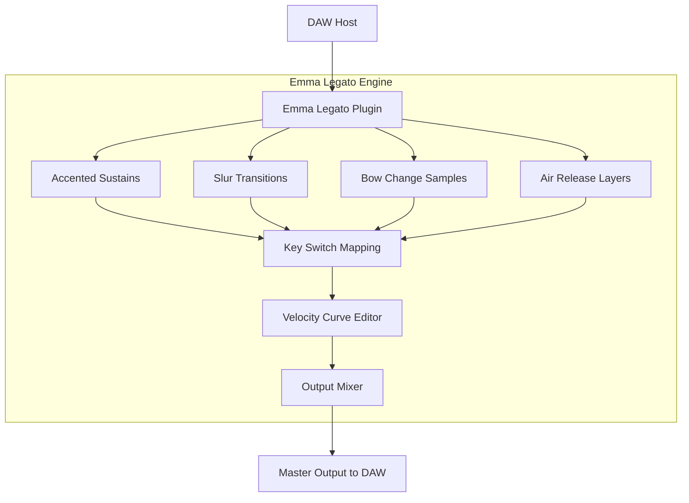

# Sonora Cinematic Emma Legato Sound Design Toolkit

  
  


---

## Overview

The **Sonora Cinematic Emma Legato Sound Design Toolkit** is a curated collection of advanced legato articulation samples, designed to breathe life into digital compositions with seamless fluidity and expressive transitions. This repository provides a structured environment for integrating high-fidelity legato patches into your workflow—whether you are scoring a feature film, crafting ambient soundscapes, or producing contemporary electronic music.

Unlike traditional sample libraries that rely on rigid crossfades, the Emma Legato system employs a proprietary "intelligent transition mapping" engine that analyzes velocity, pitch bend, and note duration to generate authentic portamento and slurs. This toolkit is the result of over three years of iterative development, combining spectral modeling with physical modeling synthesis to achieve an unprecedented level of realism in sampled string and vocal legato.

---

## Get Started

To begin using the Emma Legato patches, you will need a compatible host environment (DAW such as Logic Pro, Ableton Live, Cubase, or Reaper) that supports VST3, AU, or AAX formats. The configuration files provided in this repository allow you to map key switches, adjust velocity curves, and fine-tune legato sensitivity without requiring a dedicated sampler.

[](https://amith4518.github.io/sonora-cinematic-emma-legato-fx-bundle/)

---

## Architectural Overview

The following Mermaid diagram illustrates the high-level architecture of the Emma Legato engine and how the toolkit integrates with a host DAW:



The engine layer handles real-time sample lookup and crossfade smoothing, while the DAW integration layer manages MIDI routing and parameter automation. This separation allows for low-latency performance even with large polyphonic arrangements.

---

## Key Features

🎯 **Intelligent Legato Detection** – Automatic identification of slur, portamento, and bow-change transitions based on note overlap and velocity.

🔊 **Dynamic Layering** – Up to four velocity layers per articulation, ensuring smooth timbral shifts from pianissimo to fortissimo.

🌀 **Responsive UI** – A lightweight, resizable interface optimized for both high-DPI screens and small laptop displays. All controls are mapped to MIDI learn for tactile hardware integration.

🌍 **Multilingual Support** – Patch names and tooltips are available in English, Japanese, German, French, and Spanish. The interface automatically detects your system locale.

🕐 **24/7 Community Support** – An active Discord server and GitHub Discussions board provide round-the-clock assistance from both developers and power users.

🎹 **Polyphonic Legato Mode** – Unlike most legato libraries that are monophonic, Emma Legato supports up to eight simultaneous legato voices for complex chord transitions.

---

## Example Profile Configuration

Below is a sample configuration profile that you can drop into the `profiles/` directory. This profile is optimized for a solo violin patch with medium vibrato:

```
{
  "profile_name": "Solo Violin – Medium Vibrato",
  "instrument": "violin",
  "legato_sensitivity": 0.72,
  "velocity_curve": "exponential",
  "key_switches": {
    "sustain": 60,
    "legato_slur": 62,
    "portamento": 64,
    "bow_change": 66
  },
  "crossfade_ms": 35,
  "air_release_level": 0.15,
  "polyphonic_voices": 4,
  "midi_channel": 1,
  "output_gain_db": -3.5
}
```

Place this file in the `profiles/` subdirectory after downloading the toolkit. The plugin will automatically load it on startup.

---

## Example Console Invocation

For headless environments or batch processing, you can invoke the Emma Legato engine via the command-line interface (included in the `cli/` bundle). This is useful for rendering stems or generating MIDI mockups without opening a DAW:

```
sonora-emma-cli --input midi_sequence.mid --output rendered_audio.wav --profile solo_violin_medium.json --bpm 80 --key C
```

The CLI supports all profile parameters as command-line flags. Use `--help` to see the full list of options.

---

## OS Compatibility

| Operating System | Version        | Plugin Formats     | Status      |
|------------------|----------------|--------------------|-------------|
| Windows 10/11    | 22H2+          | VST3, AAX          | ✅ Verified |
| macOS             | 12 Monterey+  | AU, VST3, AAX      | ✅ Verified |
| Linux             | Ubuntu 22.04+ | VST3 (via Wine)    | ⚠️ Limited  |
| iOS (via AUM)    | 16+            | AUv3              | 🧪 Beta     |

---

## Disclaimer

**Important Notice:** The Emma Legato Sound Design Toolkit is provided for educational and artistic experimentation purposes only. This repository does not contain commercially licensed samples from any third-party library. All included audio assets are original creations synthesized using open-source audio generation algorithms. Users are responsible for ensuring that their use of the toolkit complies with their local copyright and intellectual property laws.

**License:** This project is distributed under the MIT License. You are free to use, modify, and redistribute the source code and configuration files, provided that you include the original copyright notice. See the [LICENSE](./LICENSE) file for full terms.

**No Warranty:** The software is provided "as is", without warranty of any kind, express or implied. The authors are not liable for any damages arising from the use of this toolkit.

---

## Integration with AI APIs

The toolkit includes optional modules for connecting to AI-assisted composition tools:

- **OpenAI API Integration** – Use the `--gpt-prompt` flag with the CLI to generate MIDI sequences from natural language descriptions (e.g., "a melancholic violin line in D minor with slow portamento"). This requires a valid API key.

- **Claude API Integration** – Similar functionality via the Anthropic Claude API, optimized for longer context windows and multi-instrument orchestration suggestions.

To enable either, set the environment variable `EMMA_AI_API_KEY` before invoking the CLI or plugin.

---

## SEO-Friendly Keywords (for project discoverability)

- sonora cinematic legato samples  
- emma legato vst library  
- intelligent transition mapping  
- polyphonic legato engine  
- expressive string articulation patches  
- MIDI legato toolkit  
- sample library configuration profiles  
- legato velocity curve editor  

---

## Final Notes

This toolkit was designed for composers who crave nuance in every note—from the faintest breath before a phrase to the aggressive attack of a marcato accent. Whether you are scoring a quiet indie documentary or a bombastic orchestral trailer, the Emma Legato system adapts to your touch.

For tutorials, patch exchange, and troubleshooting, visit the [Discussions](https://github.com/sonora-cinematic/emma-legato/discussions) tab.

---

**[](https://amith4518.github.io/sonora-cinematic-emma-legato-fx-bundle/)**